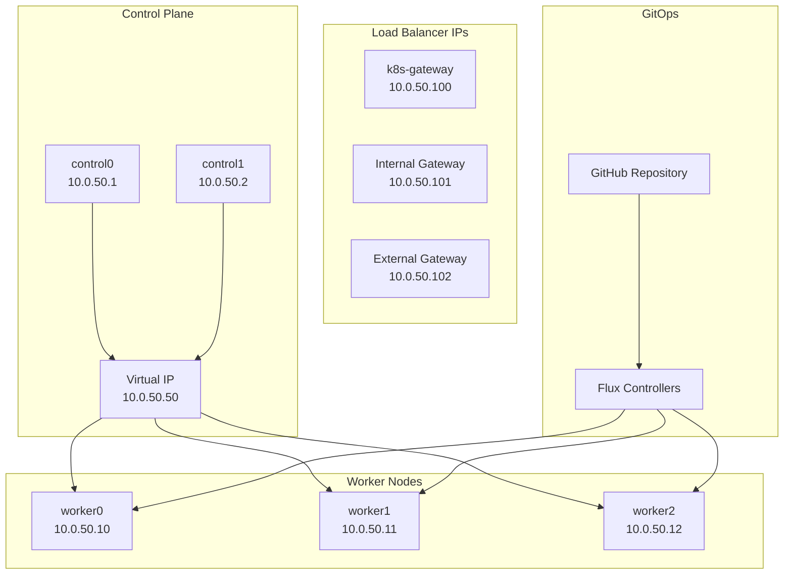
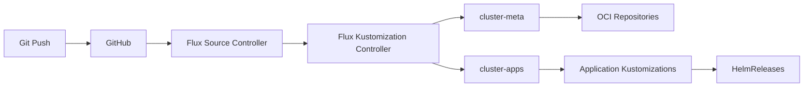
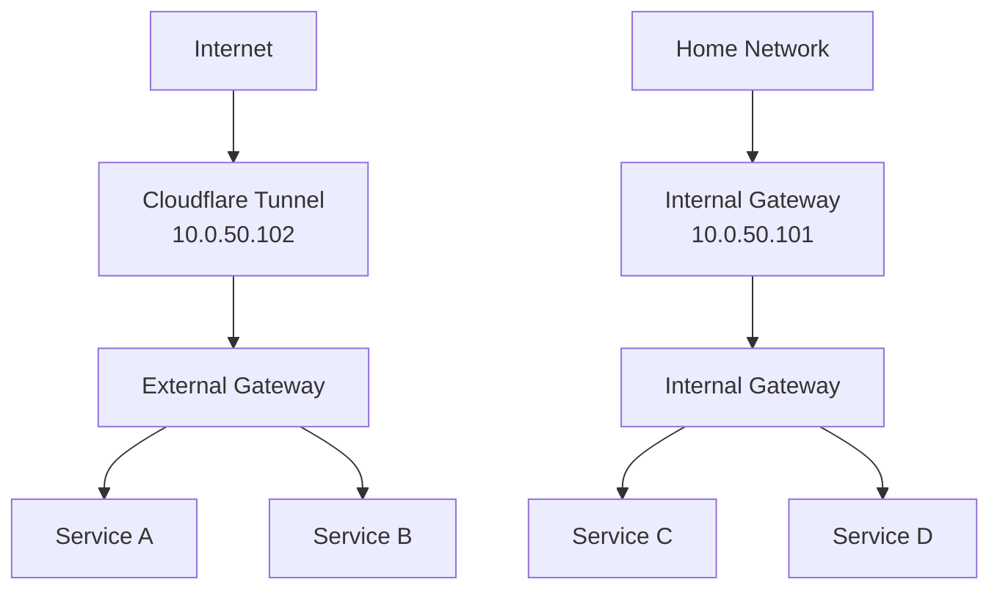
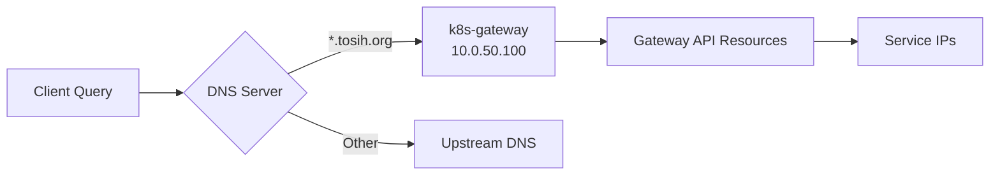
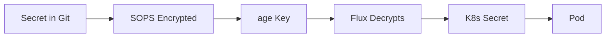

# Architecture

## System Architecture



## Configuration Management

### Template System

The cluster uses a template-driven approach with [makejinja](https://github.com/mirkolenz/makejinja):

```
cluster.yaml + nodes.yaml
         ↓
    makejinja
         ↓
├── talos/         (Talos configs)
├── kubernetes/    (K8s manifests)
└── bootstrap/     (Helmfile configs)
```

**Important**: Never edit generated files directly. Always edit source YAML files and run `task configure`.

### Directory Structure

```
home-ops/
├── .mise.toml              # Tool versions
├── Taskfile.yaml           # Task definitions
├── cluster.yaml            # Cluster configuration (SOURCE)
├── nodes.yaml              # Node configuration (SOURCE)
├── age.key                 # SOPS encryption key
├── .sops.yaml              # SOPS configuration
│
├── talos/                  # Talos Linux configs
│   ├── talconfig.yaml      # Generated by makejinja
│   ├── talenv.yaml         # Talos/K8s versions
│   ├── patches/            # Configuration patches
│   │   ├── global/         # Applied to all nodes
│   │   ├── controller/     # Control plane only
│   │   └── worker/         # Worker nodes only
│   └── clusterconfig/      # Generated per-node configs
│
├── kubernetes/             # Kubernetes manifests
│   ├── apps/               # Application deployments
│   │   ├── cert-manager/
│   │   ├── databases/
│   │   ├── kube-system/
│   │   ├── network/
│   │   └── storage/
│   └── flux/               # Flux configuration
│       ├── cluster/        # Cluster-wide Kustomizations
│       └── meta/           # Flux repositories
│
├── bootstrap/              # Initial bootstrap
│   └── helmfile.d/         # Helmfile configs
│
├── templates/              # Jinja2 templates
│   ├── config/             # Main templates
│   └── scripts/            # Template plugins
│
└── .taskfiles/             # Task implementations
    ├── bootstrap/
    ├── talos/
    └── template/
```

## GitOps Workflow

### Flux Architecture



### Reconciliation Flow

1. **Developer pushes** to Git repository
2. **Flux polls** every 1 hour (or webhook triggers immediately)
3. **Source Controller** pulls latest changes
4. **Kustomization Controller** applies manifests:
   - `cluster-meta` first (Flux repos, dependencies)
   - `cluster-apps` second (all applications)
5. **Helm Controller** installs/upgrades HelmReleases
6. **Notification** on success/failure (if configured)

## Networking

### Pod Network (Cilium)

- **CNI**: Cilium (native routing mode)
- **Pod CIDR**: 10.42.0.0/16
- **Service CIDR**: 10.43.0.0/16
- **Gateway API**: Enabled
- **Hubble**: Available for network observability

### Ingress Architecture



**Gateway Selection:**

- Use `external` gateway for public internet access (via Cloudflare Tunnel)
- Use `internal` gateway for home network only access

### DNS Flow



**Split DNS Setup Required:**

Configure your home DNS server to forward `*.yourdomain.com` to the k8s-gateway IP (10.0.50.100).

## Storage

### Storage Providers

| Provider | Type | Use Case |
|----------|------|----------|
| ZFS Provisioner | Local | Local persistent volumes on ZFS pools |
| emptyDir | Ephemeral | Temporary pod storage |
| hostPath | Node-local | Node-specific persistent data |

## Security

### Secret Management



**Encryption Flow:**

1. Developer creates secret YAML
2. `task configure` encrypts with SOPS + age
3. Encrypted secret pushed to Git
4. Flux reads age key from cluster
5. Flux decrypts and creates Kubernetes Secret
6. Pods consume secret as env vars or files

### Access Control

- **Talos**: API-only access (no SSH)
- **Kubernetes**: RBAC enabled
- **Secrets**: SOPS encrypted in Git
- **External Access**: Cloudflare Tunnel with authentication

## Update Strategy

### Component Updates

| Component | Update Method | Automation |
|-----------|---------------|------------|
| Helm Charts | Renovate PR → Merge → Flux | Automated |
| Container Images | Renovate PR → Merge → Flux | Automated |
| Kubernetes | Manual edit `talenv.yaml` → `task talos:upgrade-k8s` | Manual |
| Talos | Manual edit `talenv.yaml` → `task talos:upgrade-node` | Manual |

### Renovate Workflow


## High Availability

### Control Plane HA

- **2 control plane nodes** with shared VIP (10.0.50.50)
- **etcd quorum**: 2/2 required (50% + 1)
- **API server**: Load balanced via VIP

### Workload HA

- **Multi-replica deployments** across 3 workers
- **Pod anti-affinity** for critical apps
- **PodDisruptionBudgets** for graceful updates

## Monitoring Points

Recommended monitoring (not included by default):

- **Node metrics**: CPU, memory, disk, network
- **Cilium**: Network flows via Hubble
- **Flux**: Reconciliation status
- **Application**: Custom metrics via ServiceMonitor

## Disaster Recovery

### Backup Strategy

**Critical items to backup:**

- `age.key` - Cannot decrypt secrets without this
- `cluster.yaml` and `nodes.yaml` - Source configuration
- Git repository - Everything else can be recovered from here

**Data backups:**

- Persistent volumes - Use Velero or application-specific backup tools
- Application data - Application-specific backup tools

### Recovery Procedure

1. Reinstall Talos on nodes
2. Restore `age.key`
3. `task bootstrap:talos`
4. `task bootstrap:apps`
5. Flux restores everything from Git
6. Restore persistent data from backups
